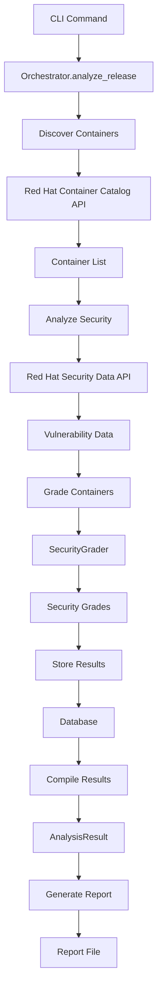

# RHOAI Security Manifest Tool - Architecture Guide

## Table of Contents
- [Overview](#overview)
- [System Architecture](#system-architecture)
- [Component Design](#component-design)
- [Data Flow](#data-flow)
- [Security Model](#security-model)
- [Performance Considerations](#performance-considerations)
- [Extensibility](#extensibility)
- [Design Decisions](#design-decisions)

## Overview

The RHOAI Security Manifest Tool follows a clean, layered architecture designed for maintainability, testability, and extensibility. This document explains the architectural patterns, design decisions, and component interactions.

## System Architecture

### High-Level Architecture

```
┌─────────────────────────────────────┐
│         CLI Layer (cli/)            │  ← User interaction
├─────────────────────────────────────┤
│      Analysis Layer (analysis/)     │  ← Business logic
├─────────────────────────────────────┤
│        API Layer (api/)             │  ← External services
├─────────────────────────────────────┤
│     Database Layer (database/)      │  ← Data persistence
├─────────────────────────────────────┤
│      Reports Layer (reports/)       │  ← Output generation
├─────────────────────────────────────┤
│       Utils Layer (utils/)          │  ← Cross-cutting concerns
└─────────────────────────────────────┘
```

### Layer Responsibilities

#### 1. CLI Layer (`cli/`)
- **Purpose**: User interface and command-line interaction
- **Components**: Main CLI, command implementations, argument parsing
- **Dependencies**: Analysis Layer, Utils Layer
- **Key Files**:
  - `main.py`: Entry point and CLI setup
  - `commands/`: Individual command implementations

#### 2. Analysis Layer (`analysis/`)
- **Purpose**: Core business logic and workflow coordination
- **Components**: Security orchestrator, grading engine
- **Dependencies**: API Layer, Database Layer
- **Key Files**:
  - `orchestrator.py`: Main workflow coordination
  - `grading.py`: Security scoring algorithm

#### 3. API Layer (`api/`)
- **Purpose**: External service integration
- **Components**: Container catalog client, security data client
- **Dependencies**: Utils Layer (for configuration)
- **Key Files**:
  - `container_catalog.py`: Red Hat Container Catalog integration
  - `security_data.py`: Security vulnerability data integration

#### 4. Database Layer (`database/`)
- **Purpose**: Data persistence and caching
- **Components**: Models, repositories, schema management
- **Dependencies**: None (pure data layer)
- **Key Files**:
  - `models.py`: SQLAlchemy ORM models
  - `repository.py`: Data access patterns
  - `schema.py`: Database initialization

#### 5. Reports Layer (`reports/`)
- **Purpose**: Output generation and formatting
- **Components**: Report generators for different formats
- **Dependencies**: None (pure output layer)
- **Key Files**:
  - `generators/html.py`: HTML report generation

#### 6. Utils Layer (`utils/`)
- **Purpose**: Cross-cutting concerns and shared utilities
- **Components**: Configuration, logging, common utilities
- **Dependencies**: None
- **Key Files**:
  - `config.py`: Configuration management
  - `logging.py`: Logging setup

## Component Design

### Security Analysis Orchestrator

The orchestrator implements the **Coordinator Pattern** to manage the complex workflow:

```python
class SecurityAnalysisOrchestrator:
    """
    Coordinates the complete security analysis workflow:
    1. Container Discovery
    2. Security Analysis
    3. Grading
    4. Persistence
    5. Result Compilation
    """
```

**Design Patterns Used**:
- **Dependency Injection**: Components injected via constructor
- **Template Method**: Standardized workflow with customizable steps
- **Strategy Pattern**: Pluggable grading algorithms

### Security Grading Engine

Implements the **Strategy Pattern** for flexible scoring algorithms:

```python
class SecurityGrader:
    """
    Pluggable security grading with configurable criteria.
    Supports custom grading algorithms and Red Hat grade override.
    """
```

**Key Features**:
- Configurable scoring criteria
- Multiple grading strategies
- Detailed score breakdown
- Red Hat grade integration

### API Clients

Follow the **Adapter Pattern** to abstract external service differences:

```python
class ContainerCatalogClient:
    """Adapts Red Hat Container Catalog API to internal interfaces."""

class SecurityDataClient:
    """Adapts Red Hat Security Data API to internal interfaces."""
```

**Design Benefits**:
- Abstraction of external API complexity
- Consistent internal interfaces
- Easy testing with mock adapters
- Graceful handling of API changes

### Database Layer

Implements **Repository Pattern** for clean data access:

```python
class ReleaseRepository:
    """Encapsulates all database operations for Release entities."""

class ContainerRepository:
    """Encapsulates all database operations for Container entities."""
```

**Architecture Benefits**:
- Separation of business logic from data access
- Easy unit testing with mock repositories
- Database-agnostic business logic
- Centralized query optimization

## Data Flow

### Primary Analysis Workflow



### Data Transform Pipeline

1. **External Data → Internal Models**
   ```python
   ContainerCatalogAPI → ContainerImage → Database.Container
   SecurityDataAPI → ContainerSecurityInfo → Database.Vulnerability
   ```

2. **Analysis Processing**
   ```python
   ContainerSecurityInfo → SecurityGrader → SecurityGrade + Score
   ```

3. **Result Compilation**
   ```python
   Database.Models → AnalysisResult → ReportData → OutputFile
   ```

### Caching Strategy

The tool implements multi-level caching:

```
┌─────────────┐    ┌─────────────┐    ┌─────────────┐
│   API Cache │ →  │ Memory Cache│ →  │ Database    │
│ (HTTP layer)│    │ (Session)   │    │ (Persistent)│
└─────────────┘    └─────────────┘    └─────────────┘
```

**Cache Levels**:
1. **HTTP Cache**: Automatic caching of API responses
2. **Memory Cache**: Session-level caching of processed data
3. **Database Cache**: Persistent caching across sessions

## Security Model

### Input Validation

All user inputs are validated at multiple layers:

```python
# CLI Layer: Click parameter validation
@click.option("--release", required=True, help="...")
def generate(release: str):
    _validate_release_format(release)  # Format validation

# Business Layer: Business rule validation
def analyze_release(release_version: str):
    if not self._is_valid_release(release_version):
        raise InvalidReleaseError(...)
```

### API Security

- **HTTPS Only**: All external API calls use HTTPS
- **Timeout Protection**: Configurable timeouts prevent hanging
- **Rate Limiting**: Respect API rate limits with exponential backoff
- **Error Isolation**: API failures don't crash the application

### Data Security

- **No Sensitive Data Storage**: No API keys or credentials stored
- **Local Database**: SQLite database with file permissions
- **Audit Trail**: All operations logged for security audit
- **Data Retention**: Configurable data retention policies

### Threat Model

**Identified Threats**:
1. **API Manipulation**: Malicious API responses
2. **Dependency Confusion**: Malicious packages
3. **Local File Access**: Unauthorized database access
4. **Resource Exhaustion**: DoS via resource consumption

**Mitigations**:
1. Input validation and schema verification
2. Dependency pinning and security scanning
3. File permission management
4. Resource limits and timeout controls

## Performance Considerations

### Scalability Design

#### Concurrent Processing
```python
# Async/await for I/O operations
async def analyze_release(...):
    # Concurrent container discovery
    containers = await asyncio.gather(
        *[self._discover_container(name) for name in container_names]
    )
```

#### Memory Management
- Streaming JSON parsing for large responses
- Lazy loading of vulnerability details
- Configurable batch sizes for bulk operations
- Database connection pooling

#### Caching Strategy
- Multi-level caching (HTTP, memory, database)
- Cache invalidation based on data freshness
- Configurable cache retention policies
- Offline mode for performance-critical scenarios

### Performance Metrics

**Target Performance**:
- Container discovery: < 30 seconds for 50 containers
- Security analysis: < 60 seconds for 50 containers
- Report generation: < 10 seconds for any format
- Database operations: < 1 second for typical queries

**Monitoring Points**:
- API response times
- Database query performance
- Memory usage during analysis
- Cache hit/miss ratios

## Extensibility

### Plugin Architecture

The tool is designed for easy extension through several patterns:

#### 1. Custom Grading Algorithms
```python
class CustomGrader(SecurityGrader):
    def _calculate_security_score(self, security_info):
        # Custom scoring logic
        return score, breakdown
```

#### 2. Additional Report Formats
```python
class PDFReportGenerator:
    def generate_report(self, report_data, output_path):
        # PDF generation logic
        pass

# Register in CLI
def _write_pdf_report(report_data, output_path):
    generator = PDFReportGenerator()
    generator.generate_report(report_data, output_path)
```

#### 3. Custom API Clients
```python
class CustomSecurityClient:
    async def bulk_analyze_containers(self, container_data):
        # Custom security data source
        return security_analyses
```

#### 4. Additional CLI Commands
```python
@cli.command()
def my_custom_command():
    """Custom functionality."""
    pass

# Auto-registration in main.py
cli.add_command(my_custom_command)
```

### Extension Points

1. **Security Grading**: Custom algorithms via `GradingCriteria`
2. **Data Sources**: Alternative API clients
3. **Output Formats**: Additional report generators
4. **Storage Backends**: Alternative database providers
5. **CLI Commands**: New functionality via Click commands

## Design Decisions

### Key Architectural Decisions

#### 1. Layered Architecture
**Decision**: Use strict layer separation
**Rationale**: 
- Clear separation of concerns
- Easy testing and mocking
- Independent evolution of layers
- Better maintainability

**Trade-offs**: 
- More boilerplate code
- Potential performance overhead
- Learning curve for contributors

#### 2. Async/Await for I/O
**Decision**: Use asyncio for all external API calls
**Rationale**:
- Better performance with concurrent requests
- Non-blocking I/O operations
- Scalability for large container sets

**Trade-offs**:
- Increased complexity
- Async/sync boundary management
- Debugging complexity

#### 3. SQLite for Local Storage
**Decision**: Use SQLite as default database
**Rationale**:
- Zero-configuration deployment
- Good performance for read-heavy workloads
- Built-in Python support
- Easy backup and distribution

**Trade-offs**:
- Limited concurrent write performance
- Not suitable for distributed deployment
- File-based storage limitations

#### 4. Click for CLI Framework
**Decision**: Use Click instead of argparse
**Rationale**:
- Rich feature set (colors, progress bars, etc.)
- Excellent documentation and community
- Easy command composition
- Built-in help generation

**Trade-offs**:
- Additional dependency
- Click-specific patterns
- Learning curve

#### 5. Pydantic for Data Validation
**Decision**: Use Pydantic for configuration and data models
**Rationale**:
- Automatic validation and serialization
- Type hints integration
- Excellent error messages
- Modern Python patterns

**Trade-offs**:
- Runtime overhead for validation
- Additional dependency
- Learning curve for contributors

### Alternative Architectures Considered

#### 1. Microservices Architecture
**Rejected**: Too complex for single-purpose tool
**Reasoning**: Added complexity without clear benefits

#### 2. Event-Driven Architecture
**Rejected**: Unnecessary complexity for linear workflow
**Reasoning**: Simple orchestration is sufficient

#### 3. Plugin-Based Architecture
**Partially Adopted**: Used for extensibility but not core architecture
**Reasoning**: Balance between flexibility and simplicity

## Future Architecture Considerations

### Planned Enhancements

1. **Distributed Caching**: Redis integration for shared cache
2. **Message Queue**: Asynchronous processing for large deployments
3. **Web Interface**: REST API and web dashboard
4. **Metrics Collection**: Prometheus/OpenTelemetry integration

### Scalability Roadmap

1. **Phase 1**: Current single-machine architecture
2. **Phase 2**: Horizontal scaling with shared cache
3. **Phase 3**: Distributed processing with message queues
4. **Phase 4**: Cloud-native deployment with Kubernetes

---

This architecture provides a solid foundation for the current requirements while maintaining flexibility for future enhancements. The layered design ensures that components can evolve independently while maintaining clear contracts between layers.